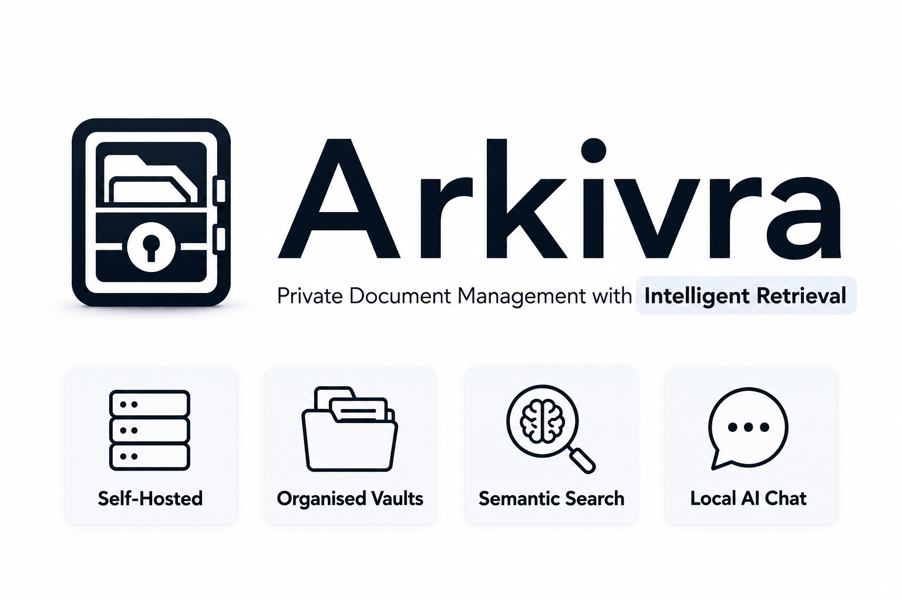

<p align="center">
  
</p>

<p align="center">
  <a href="https://arkivra.app">Website</a>
  <span>&nbsp;&nbsp;•&nbsp;&nbsp;</span>
  <a href="https://docs.arkivra.app">Documentation</a>
  <span>&nbsp;&nbsp;•&nbsp;&nbsp;</span>
  <a href="https://docs.arkivra.app/self-hosting">Self-hosting</a>
  <span>&nbsp;&nbsp;•&nbsp;&nbsp;</span>
  <a href="#features">Features</a>
  <span>&nbsp;&nbsp;•&nbsp;&nbsp;</span>
  <a href="#quick-start">Quick Start</a>
</p>

---

## What is Arkivra?

Arkivra is a self-hosted document management system built for people who want to keep their documents private, searchable, and under their control.

Organize files into vaults, search through them with full-text and semantic retrieval, and interact with your documents using locally configured Ollama models.

The platform is built for homelabs, small teams, and privacy-conscious users who want modern document retrieval without depending on cloud platforms.

---

## Status

Arkivra is under active development.

The core platform is already usable, but deployment, documentation, and operational tooling are still being refined before the first stable release.

---

## Features

- Organize documents into vaults
- Vault members, roles, and permission management
- Upload, preview, download, restore, and trash workflows
- Full-text and semantic search
- Chat with documents, vaults, or your entire library using Ollama
- Docling-based document parsing and ingestion
- Tags, filters, and metadata management
- Email/password auth, OAuth, and 2FA
- Encryption at rest for uploaded files
- Light and dark theme support
- Customize the interface with adjustable density, typography, accent colors, and layout preferences

---

## Quick Start

```bash
git clone https://github.com/Jasnan/Arkivra.git
cd Arkivra

cp .env.example .env

# Generate an encryption key
openssl rand -hex 32

docker compose up -d
curl http://localhost:1221/api/health
```

Arkivra should now be available at:

- Web: http://localhost:5173
- API: http://localhost:1221

---

## Local Development

```bash
pnpm install
pnpm db:migrate
pnpm dev:api
pnpm dev:web
```

For parallel branch work, use Git worktrees with distinct ports and `APP_INSTANCE` values.

Docker Compose currently starts PostgreSQL with pgvector, Docling, the API process, and the worker.

More detailed setup, deployment, and operational documentation is available at:

- https://docs.arkivra.app

---

## Security

Arkivra encrypts uploaded files and extracted assets at rest.

Search and chat features require derived data to be stored in PostgreSQL, including extracted text, chunks, embeddings, vectors, chat history, and related metadata.

Arkivra is not designed as a zero-knowledge or end-to-end encrypted vault.

For production deployments:
- keep PostgreSQL private,
- restrict server access,
- use strong secrets,
- and back up `ARKIVRA_ENCRYPTION_KEYS` separately.

Losing the active encryption key means losing access to encrypted stored files.

---

## Stack

| Layer      | Technology                                                          |
| ---------- | ------------------------------------------------------------------- |
| Frontend   | React, Vite, TypeScript, Chakra UI, TanStack Router, TanStack Query |
| Backend    | Hono, Node.js, TypeScript                                           |
| Auth       | Better Auth                                                         |
| Database   | PostgreSQL, Drizzle ORM, pgvector                                   |
| Jobs       | PostgreSQL-backed workers                                           |
| Parsing    | Docling                                                             |
| AI         | Ollama                                                              |
| Deployment | Docker Compose                                                      |

---

## Inspiration

Arkivra is inspired by projects and products that focus on practical, privacy-conscious document workflows and clean user experiences.

That includes projects like [Paperless-ngx](https://paperless-ngx.com/), [Papra](https://papra.app/), and [Filen](https://filen.io/), alongside the broader self-hosted and local-first ecosystem.

---

## License

Arkivra is licensed under the [AGPL-3.0](LICENSE).