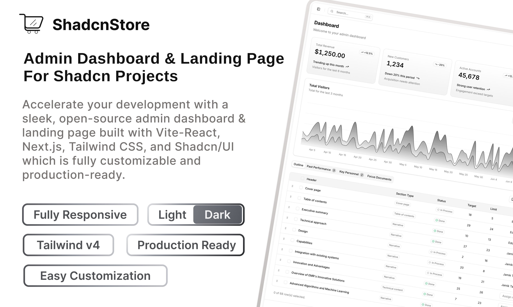

<p align="center">
  
</p>

<p align="center">
  <a href="https://arkivra.app">Website</a>
  <span>&nbsp;&nbsp;•&nbsp;&nbsp;</span>
  <a href="https://docs.arkivra.app">Documentation</a>
  <span>&nbsp;&nbsp;•&nbsp;&nbsp;</span>
  <a href="https://docs.arkivra.app/self-hosting/using-docker-compose/">Self-hosting</a>
  <span>&nbsp;&nbsp;•&nbsp;&nbsp;</span>
  <a href="#what-you-can-do-with-arkivra">Features</a>
  <span>&nbsp;&nbsp;•&nbsp;&nbsp;</span>
  <a href="#try-it-locally">Try it locally</a>
</p>

---

## What is Arkivra?

Arkivra helps you keep your documents organized, searchable, and easy to find.

It is an open-source document management system for organizing files in vaults, searching their contents, and staying in control of where your documents live.

Use it as a straightforward place to manage documents. When it fits your workflow, you can enable AI features such as document chat, translation, and AI-assisted search.

---

## Why Arkivra?

Arkivra started from a simple need: I wanted a place to keep documents organized, searchable, and under my control, without making AI the center of the product.

I wanted vaults for separating different areas of life or work, folders and tags for adding structure, reliable search for finding things later, and the option to use AI only when it genuinely helps.

Today, Arkivra is the document management system I wanted for myself. My hope is that it will also be useful to individuals, families, homelab enthusiasts, and small teams looking for a practical way to manage documents without unnecessary complexity.

---

## What you can do with Arkivra

### Organize Documents

- Vaults for grouping documents however you prefer
- Tags, filters, and metadata management
- Document version history and restore workflows
- Trash and recovery support
- Vault members, roles, and permission management

### Find Information Faster

- Full-text search across your documents
- Document previews and metadata browsing
- Optional search by meaning, not just exact words

### Optional AI Features

- Chat with selected documents or vaults
- Experimental document translation
- Choose local or cloud AI providers when you enable AI features
- Use AI when it helps, or leave it disabled entirely

### Stay in Control

- Open source and self-hostable
- Uploaded files and stored extracted assets are encrypted at rest
- Sign in with email/password, OAuth, or two-factor authentication
- Choose where Arkivra runs and which optional integrations you enable

---

## Try it locally

```bash
git clone https://github.com/Jasnan/Arkivra.git
cd Arkivra

cp .env.example .env

# Generate the required file encryption key
printf 'ARKIVRA_ENCRYPTION_KEYS=1:%s\n' "$(openssl rand -hex 32)" >> .env

# Start Docling separately. For Docker Desktop or Linux Docker Engine:
docker run --name arkivra-docling -d -p 5001:5001 -e DOCLING_SERVE_ENABLE_UI=1 quay.io/docling-project/docling-serve-cpu

# Point Arkivra's containers at that external Docling endpoint:
sed -i.bak 's#^ARKIVRA_DOCLING_URL=.*#ARKIVRA_DOCLING_URL=http://host.docker.internal:5001#' .env

docker compose up -d
curl http://localhost:3210/api/health
```

Open the dashboard at http://localhost:3210. The server container serves both the API and the dashboard in the Docker Compose stack.

Document parsing needs a reachable Docling Serve endpoint. Arkivra does not include Docling in its default Docker Compose stack; set `ARKIVRA_DOCLING_URL` to a local, network, or hosted Docling service before starting the API and worker.

You can upload, organize, preview, restore, and search documents without configuring any AI provider.

---

## Project Status

Arkivra is under active development and not yet at a stable 1.0 release.

The core document workflow is usable today. Deployment, documentation, operational tooling, and AI-assisted features are still improving as the project grows.

Feedback, bug reports, and contributions are always welcome.

---

## Development

Arkivra is a pnpm monorepo with separate API, worker, dashboard, website, and docs apps.

For local development setup, commands, tests, and operational notes, see the [documentation](https://docs.arkivra.app).

---

## Security

Arkivra requires file encryption keys and encrypts uploaded files and stored extracted assets at rest.

The project is designed to give you control over your documents, infrastructure, and optional integrations.

For deployment guidance, encryption details, backups, and security considerations, see the [documentation](https://docs.arkivra.app).

---

## Inspiration

Arkivra draws inspiration from projects that make document management practical, approachable, and enjoyable to use.

That includes projects like [Paperless-ngx](https://paperless-ngx.com/), [Papra](https://papra.app/), and [Filen](https://filen.io/), alongside the broader self-hosted and local-first ecosystem.

---

## License

Arkivra is licensed under the [AGPL-3.0](LICENSE).

---

## About the Project

Arkivra is an open-source project created and maintained by [Jasnan Thachaparamban](https://jasnan.xyz).

It began as a personal project and continues to grow through curiosity, experimentation, and feedback from friends who have tested early versions.

If Arkivra looks useful, consider giving it a star, trying it out, reporting issues, or sharing ideas. Every piece of feedback helps shape where the project goes next.
