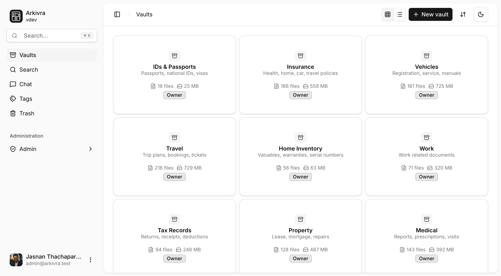

  

  <a href="https://arkivra.app">Website</a>
  &nbsp;&nbsp;•&nbsp;&nbsp;
  <a href="https://docs.arkivra.app">Documentation</a>
  &nbsp;&nbsp;•&nbsp;&nbsp;
  <a href="https://docs.arkivra.app/getting-started/quick-start/">Quick start</a>

## What is Arkivra?

Arkivra is an open-source document management system for keeping documents organized, searchable, and under your control.

It started from a simple need: I wanted a practical place to manage documents without making AI the center of the product. I wanted vaults to separate different areas of life or work, folders and tags to keep things organized, reliable search to find information later, and the option to use AI only when it genuinely adds value.

You can use Arkivra as a straightforward document management system for organizing files into vaults, searching their contents, and deciding where your documents live. When it fits your workflow, **you can optionally enable AI features such as document chat, translation, and AI-assisted search** by connecting to local Ollama models or a supported cloud AI provider.

Today, Arkivra is the document management system I wanted for myself. My hope is that it is equally useful for individuals, families, homelab enthusiasts, and small teams looking for a practical way to manage documents without unnecessary complexity.

  <a href="https://arkivra.app">
    <picture>
      <source srcset="apps/arkivra-client/src/assets/vaults_screenshot_grid_light.png" media="(prefers-color-scheme: light)">
      <source srcset="apps/arkivra-client/src/assets/vaults_screenshot_grid_dark.png" media="(prefers-color-scheme: dark)">
      
    </picture>
  </a>

## Features

### Document management

- **Vaults and folders:** Separate document collections and build a folder structure inside each vault.
- **Tags and metadata:** Add context to documents and filter the library when browsing or searching.
- **Document previews:** View supported files and inspect extracted content from the dashboard.
- **Version history:** Keep immutable versions and restore older content without erasing the history.
- **Trash and recovery:** Restore deleted documents or remove them permanently.

### Search and retrieval

- **Content extraction:** Use Docling to extract text from supported documents and scanned files.
- **Full-text search:** Search filenames and extracted text with PostgreSQL. No AI model is needed.
- **Filters:** Narrow results by vault, tag, or modification date.
- **Background indexing:** Process uploads without blocking the main document workflow.

### Optional AI tools

- **Semantic search:** Find documents by meaning when the exact words do not match.
- **Document chat:** Ask questions across selected documents, folders, or vaults. Open citations to check the source.
- **PDF translation:** Translate selected text or rendered PDF content between English and German.
- **Provider choice:** Use a local Ollama-compatible endpoint or connect Google Gemini.

### Self-hosting and administration

- **Docker Compose:** Build and run Arkivra with PostgreSQL on your own server.
- **Access control:** Use vault roles and platform privileges to control access to each collection.
- **Authentication:** Use email and password, TOTP, or optional Google and GitHub OAuth.
- **Backups:** Create encrypted backup sets that contain the database dump and stored document files.
- **Activity and audit:** Review user-facing activity and security-focused administrative records.
- **Optional office previews:** Connect Gotenberg for supported Office and OpenDocument files.

## Self-hosting

Arkivra is designed to run on infrastructure you manage. The documentation covers prerequisites, Docker Compose, document processing, configuration, and production considerations.

Follow the [quick-start guide](https://docs.arkivra.app/getting-started/quick-start/) to try Arkivra. For a complete deployment walkthrough, see [self-hosting with Docker Compose](https://docs.arkivra.app/self-hosting/using-docker-compose/).

## Storage and privacy

| Stored data                                     | Encrypted by Arkivra |
| ----------------------------------------------- | -------------------- |
| Uploaded originals and retained version sources | Yes                  |
| Stored extracted asset files                    | Yes                  |
| Arkivra backup archives                         | Yes                  |
| PostgreSQL rows and derived data                | No                   |

PostgreSQL holds extracted text and metadata. Chat history and embeddings also live there. The same applies to audit records and job state. Arkivra does not add application-layer encryption to these rows.

Remote processors and AI providers receive the document content needed for the feature you use. Review the [privacy and security guide](https://docs.arkivra.app/operations/privacy-and-security/) before using Arkivra with sensitive documents.

## Project status

Arkivra is still evolving and has not yet reached a stable 1.0 release. The core document management features are stable for everyday use, and AI features such as semantic search are also considered stable. Document chat is usable but still being refined, while translation remains experimental. As development continues, some interfaces and configuration options may change. For production deployments or instances containing important documents, test upgrades before applying them.

Bug reports, focused pull requests, and practical feedback are welcome through the [GitHub repository](https://github.com/Jasnan/Arkivra).

## Development

Arkivra is a pnpm monorepo with four application packages:

| Path                  | Purpose                                                            |
| --------------------- | ------------------------------------------------------------------ |
| `apps/arkivra-server` | API, workers, database schema, storage, search, and administration |
| `apps/arkivra-client` | React dashboard                                                    |
| `apps/arkivra-docs`   | Documentation site built with Astro and Starlight                  |
| `apps/website`        | Project website built with Astro                                   |

The [documentation](https://docs.arkivra.app) covers source setup and operational guidance.

## Inspiration

Arkivra draws inspiration from the open-source document management and self-hosting ecosystem. This includes [Paperless-ngx](https://paperless-ngx.com/), [Papra](https://papra.app/), and [Filen](https://filen.io/).

## License

Arkivra is licensed under the [AGPL-3.0 License](LICENSE).

## Maintainer

Arkivra was created and is maintained by [Jasnan Thachaparamban](https://jasnan.xyz).
